<div align="center">

# HYPERTROPHY-X

### Kişiselleştirilmiş Antrenman, Takip ve Uzman Karar Destek Platformu

**FastAPI · Vanilla JavaScript SPA · SQLite/PostgreSQL · JWT · Kural Tabanlı Uzman Sistem**

[](https://fastapi.tiangolo.com/)
[](https://developer.mozilla.org/en-US/docs/Web/JavaScript)
[](https://www.postgresql.org/)
[](#lisans)

</div>

---

## İçindekiler

- [Projenin Amacı](#projenin-amacı)
- [Temel Özellikler](#temel-özellikler)
- [Mimari Özet](#mimari-özet)
- [Teknoloji Yığını](#teknoloji-yığını)
- [Proje Yapısı](#proje-yapısı)
- [İstekten Yanıta Veri Akışı](#i̇stekten-yanıta-veri-akışı)
- [SPA ve Frontend Mimarisi](#spa-ve-frontend-mimarisi)
- [Backend Mimarisi](#backend-mimarisi)
- [Kimlik Doğrulama ve Güvenlik](#kimlik-doğrulama-ve-güvenlik)
- [Veritabanı Mimarisi](#veritabanı-mimarisi)
- [Veritabanı Tabloları](#veritabanı-tabloları)
- [Uzman Sistem](#uzman-sistem)
- [Dinamik Program Üretimi](#dinamik-program-üretimi)
- [RIR ve RPE Mantığı](#rir-ve-rpe-mantığı)
- [Egzersiz Kataloğu ve Alias Yapısı](#egzersiz-kataloğu-ve-alias-yapısı)
- [API Grupları](#api-grupları)
- [Hızlı Başlangıç](#hızlı-başlangıç)
- [Test ve Doğrulama](#test-ve-doğrulama)
- [Deployment](#deployment)
- [Güvenlik Kontrol Listesi](#güvenlik-kontrol-listesi)
- [Geliştirme İlkeleri](#geliştirme-i̇lkeleri)
- [Bilinen Sınırlar](#bilinen-sınırlar)
- [Lisans](#lisans)
- [Referanslar](#referanslar)

---

## Projenin Amacı

**Hypertrophy-X**, kullanıcıların kişisel profil bilgilerini, antrenman geçmişini, egzersiz tercihlerini, salon ekipmanlarını, kas ağrısı ve sakatlık bildirimlerini tek bir platformda yönetmesini sağlayan bir web uygulamasıdır.

Platformun temel amacı yalnızca antrenman kaydı oluşturmak değildir. Sistem, kullanıcının geçmiş verilerini ve güncel bildirimlerini birlikte değerlendirerek kişiselleştirilmiş bir antrenman planlama desteği sunar.

> **Frontend kullanıcının etkileşim kurduğu arayüzdür. Backend veriyi doğrulayan ve iş kurallarını uygulayan kontrol merkezidir. Veritabanı bilgilerin kalıcı hafızasıdır. Uzman sistemi ise bu bilgileri açıklanabilir kurallarla yorumlayan karar destek katmanıdır.**

Proje, tek sayfa uygulaması yaklaşımıyla geliştirilmiştir. Kullanıcı menüden farklı bölümlere geçerken tarayıcı her seferinde yeni bir HTML dosyası indirmez. JavaScript, aynı sayfa içindeki ilgili ekranı gösterir ve gerekli API isteğini FastAPI backend’ine gönderir.

---

## Temel Özellikler

| Alan | Özellik | Açıklama |
|---|---|---|
| Hesap | Kayıt ve giriş | Kullanıcı hesabı oluşturma ve JWT tabanlı oturum açma |
| Profil | Sporcu profili | Yaş, boy, kilo, seviye, hedef, haftalık gün ve seans süresi |
| Antrenman | Workout kaydı | Seans, egzersiz, set, tekrar, ağırlık, RIR ve salon bilgisi |
| Geçmiş | Antrenman geçmişi | Eski seansları görüntüleme ve kontrollü düzenleme |
| İlerleme | Grafik ve metrikler | Hacim, ağırlık, tekrar, kas dağılımı ve performans takibi |
| Egzersiz | Katalog ve alias | Kanonik hareket kimlikleri, eski ad eşlemeleri ve alternatifler |
| Uzman sistem | Kural tabanlı analiz | DOMS, sakatlık, tendon, ekipman, RPE ve hedef kuralları |
| Program | Dinamik split | Haftalık gün sayısına, hedeflere ve ekipmana göre öneri taslağı |
| Tercihler | Hareket seçimi | Kullanıcının tercih ettiği veya kaçınmak istediği hareketler |
| Salon | Ekipman yönetimi | Birden fazla salon, varsayılan salon ve ekipman listesi |
| Plan | Sürükle-bırak | Pazartesi–Pazar slotları sabit kalırken seans içeriği düzenlenir |
| Admin | Ürün odaklı yönetim | Kullanıcı, seans, veri sağlığı ve uzman sistemi metrikleri |
| Deployment | Bulut hazırlığı | Railway, Render ve VPS için başlangıç dosyaları |

---

## Mimari Özet

Hypertrophy-X’in çalışma modeli aşağıdaki katmanlardan oluşur:

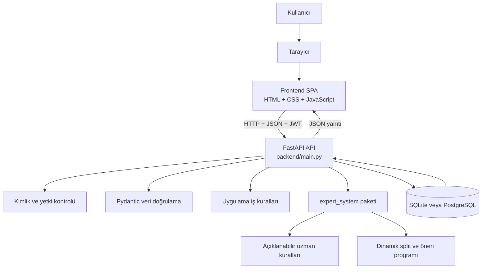

### Katmanların sorumlulukları

| Katman | Sorumluluk | Projedeki karşılığı |
|---|---|---|
| Sunum | Form, kart, grafik ve sayfa geçişlerini yönetir | `backend/static/index.html`, `frontend/index.html` |
| API | İstekleri alır ve JSON yanıt üretir | `backend/main.py` |
| Güvenlik | JWT, parola hash’i ve rol kontrolü yapar | Auth dependency’leri ve admin kontrolleri |
| Alan mantığı | Workout, profil, beslenme ve katalog davranışını yönetir | `main.py`, `exercise_catalog.py`, `program_schedule_sync.py` |
| Uzman sistemi | Kullanıcı verilerini kurallara göre yorumlar | `backend/expert_system/` |
| Veri | Bilgileri kalıcı biçimde saklar | SQLite veya PostgreSQL |

---

## Teknoloji Yığını

| Teknoloji | Kullanım amacı |
|---|---|
| Python 3.10+ | Backend programlama dili |
| FastAPI | REST API ve uygulama sunucusu |
| Uvicorn | ASGI sunucusu |
| Pydantic | İstek ve veri modellerinin doğrulanması |
| SQLite | Yerel geliştirme ve taşınabilir veritabanı |
| PostgreSQL | Üretim ve çok kullanıcılı kullanım seçeneği |
| Vanilla JavaScript | SPA davranışı ve API istemcisi |
| HTML/CSS | Arayüz ve responsive tasarım |
| Chart.js | Grafik ve veri görselleştirme |
| JWT | Token tabanlı kimlik doğrulama |
| bcrypt uyumlu hash | Parola güvenliği |
| Mermaid | Mimari ve veri akışı diyagramları |
| Railway / Render | PaaS deployment seçenekleri |
| Nginx / systemd | VPS deployment seçeneği |

---

## Proje Yapısı

```text
Hypertrophy-X-v4.0/
├── README.md
├── .gitignore
├── backend/
│   ├── main.py                         # FastAPI uygulaması ve API koordinatörü
│   ├── requirements.txt                # Python bağımlılıkları
│   ├── start.sh                        # Yerel Linux/macOS başlatma scripti
│   ├── Procfile                        # PaaS başlatma komutu
│   ├── railway.toml                    # Railway yapılandırması
│   ├── render.yaml                     # Render Blueprint yapılandırması
│   ├── .env.example                    # Ortam değişkeni şablonu
│   ├── exercise_catalog.py             # Kanonik egzersiz havuzu
│   ├── exercise_aliases.py             # Eski adları kanonik id’lere bağlar
│   ├── program_schedule_sync.py        # Program ve gerçek seans senkronizasyonu
│   ├── postgres_schema.py              # PostgreSQL şema tanımları
│   ├── migrate_sqlite_to_postgres.py   # SQLite → PostgreSQL aktarımı
│   ├── migrate_postgres_to_sqlite.py   # PostgreSQL → SQLite aktarımı
│   ├── expert_system/
│   │   ├── __init__.py                 # Paketin dışa açılan API’si
│   │   ├── core.py                     # Dinamik program ve alan mantığı
│   │   ├── evaluator.py                # Kuralları sırayla çalıştırır
│   │   ├── fuzzy_logic.py              # 0–1 arası fuzzy üyelik fonksiyonları
│   │   ├── recommendation.py           # RIR-RPE ve haftalık öneri takvimi
│   │   ├── rule_utils.py               # Ortak kural yardımcıları
│   │   └── rules/
│   │       ├── rule_active_injury.py
│   │       ├── rule_doms_recovery.py
│   │       ├── rule_equipment.py
│   │       ├── rule_rpe_effort.py
│   │       ├── rule_targets.py
│   │       └── rule_tendon_injury.py
│   ├── static/
│   │   └── index.html                  # Sunulan SPA dosyası
│   └── hypertrophy.db                  # Yerel SQLite dosyası; git’e eklenmemeli
├── frontend/
│   └── index.html                      # Frontend kaynak kopyası
├── docs/
│   ├── KULLANIM.md
│   ├── MIGRATION_REHBERI.md
│   ├── REFERANSLAR.md
│   ├── Hypertrophy-X — Modern Platform Mimarisi Rehberi.md
│   └── Hypertrophy-X_Egzersiz_Katalog_Yonetim_Kilavuzu.md
└── venv/                               # Yerel sanal ortam; git’e eklenmemeli
```

> **Güncel mimari notu:** Backend endpoint’lerinin koordinasyonu `main.py` içinde tutulur. Uzman sistemi ise artık `backend/expert_system/` altında modüler bir Python paketidir. Bu nedenle uzman sistemi kodunun tamamını `main.py` içinde tutmak zorunlu değildir.

---

## İstekten Yanıta Veri Akışı

Kullanıcı arayüzünde yapılan bir işlem doğrudan veritabanına yazılmaz. Her işlem backend üzerinden geçer.

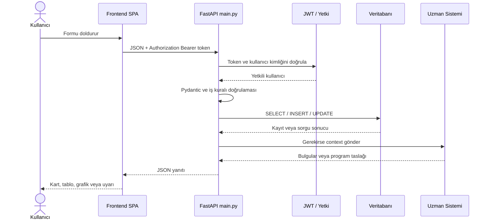

### Örnek workout kayıt isteği

```json
{
  "date": "2026-09-21",
  "session_type": "Push Day",
  "gym_id": "gym_default",
  "gym_name": "Ana Salon",
  "exercises": [
    {
      "id": "bench-press",
      "name": "Bench Press",
      "sets_data": [
        {
          "weight_kg": 80,
          "reps": 8,
          "rir": 2
        }
      ]
    }
  ]
}
```

### Örnek JSON yanıtı

```json
{
  "success": true,
  "workout_id": 42,
  "message": "Antrenman başarıyla kaydedildi."
}
```

---

## SPA ve Frontend Mimarisi

SPA, tek bir HTML dosyasının farklı ekranları göstermesi mantığıyla çalışır.

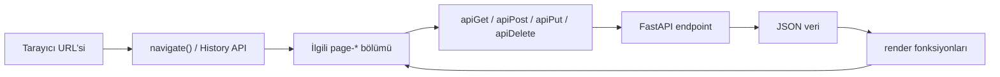

### Sayfa geçiş mantığı

Kullanıcı Dashboard, Progress veya Expert System sekmesine geçtiğinde JavaScript:

1. URL durumunu günceller.
2. İlgili `page-*` bölümünü görünür hale getirir.
3. Gerekli API isteğini gönderir.
4. Gelen JSON verisini render fonksiyonuyla ekrana basar.
5. Yükleniyor, hata ve boş veri durumlarını yönetir.

Bu yaklaşım, yeni bir ekran eklerken tek bir HTML dosyası içinde düzenli bir sayfa bölümü oluşturmayı sağlar. Ancak backend’de yeni veri davranışı gerekiyorsa bunun karşılığı mutlaka ayrı bir endpoint veya mevcut bir endpoint’in güvenli biçimde genişletilmesiyle yapılmalıdır.

### API helper yaklaşımı

```javascript
async function apiGet(path) {
  const token = localStorage.getItem("hx_access_token");
  const response = await fetch(path, {
    headers: {
      "Authorization": `Bearer ${token}`,
      "Accept": "application/json"
    }
  });

  if (!response.ok) {
    throw new Error(`API isteği başarısız: ${response.status}`);
  }

  return response.json();
}
```

Bu yaklaşımın amacı API çağrılarını her sayfada farklı biçimde yazmak yerine merkezi helper fonksiyonlarda toplamaktır.

---

## Backend Mimarisi

`backend/main.py` uygulamanın giriş kapısı ve koordinatörüdür. Her iş mantığının tek dosyada bulunması gerekmez; `main.py` ilgili modülleri çağırır.

### Backend’in ana görevleri

- FastAPI uygulamasını başlatmak.
- CORS ve güvenlik middleware’lerini çalıştırmak.
- JWT ile kullanıcıyı tanımak.
- Pydantic modelleriyle gelen isteği doğrulamak.
- Kullanıcıya ait kayıtları SQL ile okumak ve yazmak.
- Egzersiz katalog API’sini sunmak.
- Workout, profil, beslenme ve ilerleme endpoint’lerini çalıştırmak.
- Admin rolünü kontrol etmek.
- Uzman sistemi için birleşik context hazırlamak.
- JSON yanıtlarını frontend’e döndürmek.
- İstekleri ve hata durumlarını loglamak.

### SQL işlem yaşam döngüsü

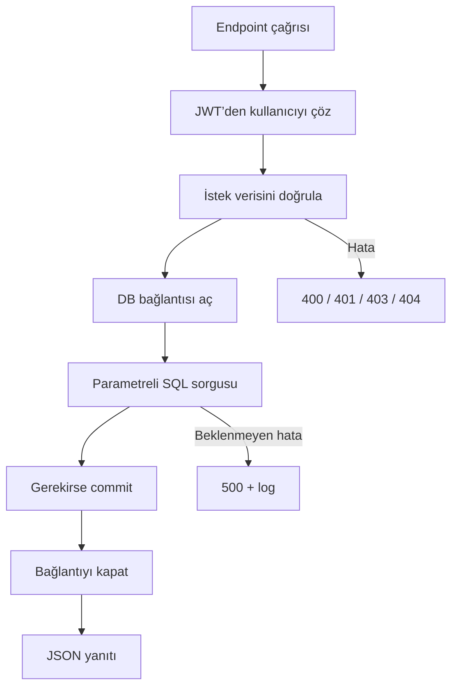

### Middleware katmanı

Projede aşağıdaki middleware davranışları bulunur:

| Middleware davranışı | Amaç |
|---|---|
| CORS | İzin verilen frontend kaynaklarını kontrol etmek |
| Cache-Control | API, HTML ve statik kaynakların önbellek davranışını ayarlamak |
| İstek loglama | Method, path, durum ve süreyi izlemek |
| Güvenlik başlıkları | Tarayıcı tarafında temel güvenlik davranışları sağlamak |
| Giriş limiti | Tekrarlanan başarısız girişleri sınırlamak |

---

## Kimlik Doğrulama ve Güvenlik

### JWT akışı

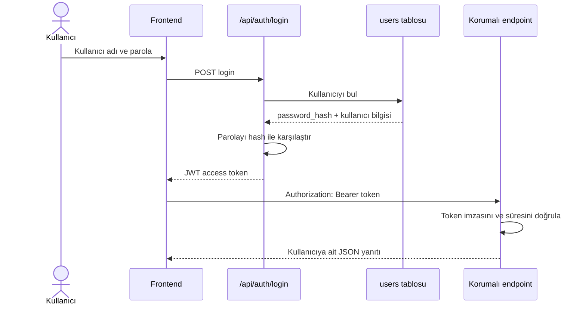

### Güvenlik prensipleri

1. Parola düz metin olarak saklanmaz.
2. Korumalı endpoint’lerde kullanıcı kimliği token üzerinden çözülür.
3. Frontend’den gelen `username` değerine tek başına güvenilmez.
4. Kullanıcının workout ve profil sorguları token’daki kullanıcı kimliğiyle sınırlandırılır.
5. Admin paneli yalnızca arayüzde gizlenmez; backend rol kontrolü de uygulanır.
6. `JWT_SECRET`, `ADMIN_PASSWORD` ve veritabanı bağlantısı ortam değişkenlerinde tutulur.
7. `.env` dosyası sürüm kontrolüne eklenmez.

### Admin ve sporcu ayrımı

Admin bilgileri `admin_roles` tablosuyla ayrıca tutulur. `users` hesabın temel kimliğini temsil ederken `athlete_profiles` sporcuya özel profili taşır. Admin hesabı için sporcu profili oluşturulmaması veya temizlenmesi, admini standart sporcu verisinden ayırır.

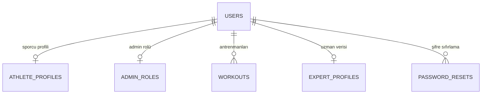

---

## Veritabanı Mimarisi

Proje iki veritabanı backend’i destekleyecek şekilde tasarlanmıştır:

- **SQLite:** Yerel geliştirme, sunum ve taşınabilir tek dosya kullanımı.
- **PostgreSQL:** Üretim ortamı, eşzamanlı kullanıcılar ve daha güçlü operasyonel kullanım.

`get_db()` fonksiyonu ortam ayarına göre uygun bağlantı sınıfını seçer. Böylece uygulama kodunun büyük bölümü SQLite veya PostgreSQL ayrıntısını doğrudan bilmek zorunda kalmaz.

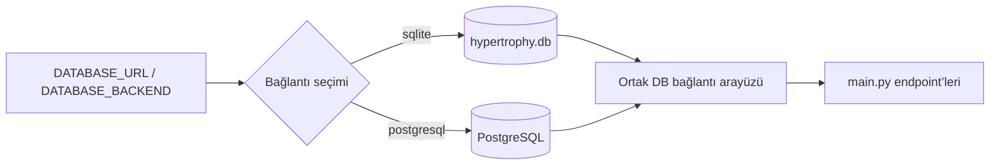

### Veri saklama yaklaşımı

Kullanıcı, workout ve uzman sistemi kayıtları birbirinden ayrılmıştır. Bazı esnek ve değişken veri grupları JSON sütunlarında tutulur. Bu seçim özellikle uzman sistemi profilinde yeni alanların eklenmesini kolaylaştırır.

Bununla birlikte JSON alanları sorgulanabilirliği azaltabileceği için yüksek hacimli üretim sisteminde sık filtrelenen alanlar ayrı tablolara taşınabilir. Mevcut yapı, geliştirme ve orta ölçekli kullanım için esnek bir başlangıç sağlar.

---

## Veritabanı Tabloları

Aşağıdaki tablo listesi `main.py` içindeki SQLite şeması ve PostgreSQL şema yaklaşımıyla uyumludur. Bazı eski sütunlar geriye dönük uyumluluk için korunmuştur.

### 1. `users`

Hesabın temel kimliğini ve geçmiş sürümlerden gelen bazı profil alanlarını tutar.

| Alan | Tür | Açıklama |
|---|---|---|
| `id` | INTEGER | Birincil anahtar |
| `username` | TEXT | Benzersiz kullanıcı adı |
| `password_hash` | TEXT | Hashlenmiş parola |
| `password_salt` | TEXT | Eski hash uyumluluğu için alan |
| `age` | INTEGER | Geriye dönük profil alanı |
| `gender` | TEXT | Geriye dönük profil alanı |
| `height` | REAL | Geriye dönük profil alanı |
| `weight` | REAL | Geriye dönük profil alanı |
| `fitness_level` | TEXT | Başlangıç, orta veya ileri seviye |
| `goal` | TEXT | Bulk, cut, strength veya maintenance |
| `days_per_week` | INTEGER | Haftalık antrenman gün sayısı |
| `session_time_mins` | INTEGER | Ortalama seans süresi |
| `stagnation_detected` | INTEGER | Durgunluk durumu |
| `custom_split` | TEXT/JSON | Kullanıcının özel programı |
| `dashboard_preferences` | TEXT/JSON | Dashboard ve uzman önerisi tercihleri |
| `created_at` | TEXT | Oluşturulma zamanı |
| `updated_at` | TEXT | Güncellenme zamanı |
| `is_admin` | INTEGER | Geriye dönük admin işareti |
| `role` | TEXT | `athlete` veya `admin` |
| `is_active` | INTEGER | Hesap aktiflik durumu |
| `email` | TEXT | E-posta alanı |

### 2. `athlete_profiles`

Sporcuya ait profil alanlarını hesap kimliğinden ayırır.

| Alan | Tür | Açıklama |
|---|---|---|
| `user_id` | INTEGER | `users.id` ile ilişkili birincil anahtar |
| `age` | INTEGER | Yaş |
| `gender` | TEXT | Cinsiyet |
| `height` | REAL | Boy |
| `weight` | REAL | Kilo |
| `fitness_level` | TEXT | Fitness seviyesi |
| `goal` | TEXT | Ana hedef |
| `days_per_week` | INTEGER | Haftalık müsait gün |
| `session_time_mins` | INTEGER | Seans süresi |
| `stagnation_detected` | INTEGER | Durgunluk işareti |
| `custom_split` | TEXT/JSON | Özel program |
| `dashboard_preferences` | TEXT/JSON | Kullanıcı tercihleri |
| `daily_nutrition` | TEXT/JSON | Beslenme hedefleri |
| `email` | TEXT | E-posta |
| `created_at` | TEXT | Oluşturulma zamanı |
| `updated_at` | TEXT | Güncellenme zamanı |

### 3. `workouts`

Kullanıcının antrenman seanslarını tutar.

| Alan | Tür | Açıklama |
|---|---|---|
| `id` | INTEGER | Birincil anahtar |
| `user_id` | INTEGER | Antrenmanın sahibi |
| `date` | TEXT | Antrenman tarihi |
| `session_type` | TEXT | Push, Pull, Legs veya özel seans adı |
| `notes` | TEXT | Kullanıcı notu |
| `gym_id` | TEXT | Seans sırasında kullanılan salon |
| `gym_name` | TEXT | Salonun görünen adı |
| `total_volume` | REAL | Toplam ağırlık × tekrar hacmi |
| `exercises` | TEXT/JSON | Egzersiz ve set verileri |
| `created_at` | TEXT | Oluşturulma zamanı |

`exercises` alanındaki örnek yapı:

```json
[
  {
    "id": "barbell-bench-press",
    "name": "Barbell Bench Press",
    "muscle_group": "Chest",
    "sets_data": [
      {
        "weight_kg": 80,
        "reps": 8,
        "rir": 2
      },
      {
        "weight_kg": 80,
        "reps": 7,
        "rir": 1
      }
    ]
  }
]
```

### 4. `expert_profiles`

Kullanıcı başına tek merkezî uzman sistemi profili tutar. Esnek veri yapıları JSON sütunları içinde saklanır.

| Alan | Tür | Açıklama |
|---|---|---|
| `user_id` | INTEGER | `users.id` ile ilişkili birincil anahtar |
| `target_muscles_json` | TEXT/JSON | Ana hedef ve öncelikli kaslar |
| `doms_daily_json` | TEXT/JSON | Günlük kas ağrısı kayıtları |
| `gym_equipment_json` | TEXT/JSON | Salonlar ve ekipmanları |
| `injuries_json` | TEXT/JSON | Sakatlık ve kısıt kayıtları |
| `rpe_checkins_json` | TEXT/JSON | Günlük veya seans değerlendirmeleri |
| `created_at` | TEXT | Oluşturulma zamanı |
| `updated_at` | TEXT | Güncellenme zamanı |

### 5. `admin_roles`

Admin kullanıcılarının rol ve izinlerini tutar.

| Alan | Tür | Açıklama |
|---|---|---|
| `user_id` | INTEGER | `users.id` ile ilişkili anahtar |
| `role_title` | TEXT | Örneğin Sistem Yöneticisi |
| `permissions_json` | TEXT/JSON | İzin listesi |
| `last_login` | TEXT | Son admin giriş zamanı |
| `created_at` | TEXT | Oluşturulma zamanı |
| `updated_at` | TEXT | Güncellenme zamanı |

### 6. `password_resets`

Parola sıfırlama akışının geçici ve doğrulama bilgilerini tutar.

| Alan | Tür | Açıklama |
|---|---|---|
| `id` | INTEGER | Birincil anahtar |
| `user_id` | INTEGER | İlgili kullanıcı |
| `email` | TEXT | Sıfırlama e-postası |
| `code` | TEXT | Doğrulama kodu |
| `reset_token` | TEXT | Sıfırlama tokenı |
| `verified_token` | TEXT | Doğrulanmış token |
| `expires_at` | TEXT | Son geçerlilik zamanı |
| `used` | INTEGER | Token kullanıldı mı? |
| `created_at` | TEXT | Oluşturulma zamanı |

### Uzman sistemi JSON örneği

```json
{
  "target_muscles": {
    "primary_goal": "hypertrophy",
    "priority_muscles": ["shoulders", "back"],
    "priority_note": "Omuz genişliği ve sırt hacmi öncelikli"
  },
  "doms_daily": {
    "2026-09-21": [
      {
        "muscle_group": "hamstrings",
        "severity": 3,
        "notes": "Hafif ağrı"
      }
    ]
  },
  "injuries": [],
  "gyms": [
    {
      "id": "gym_abc123",
      "name": "Ana Salon",
      "is_default": true,
      "equipment": ["cable_station", "lat_pulldown"]
    }
  ]
}
```

---

## Uzman Sistem

Uzman sistemi, yapay zekâ sohbet modeli yerine açıkça yazılmış kural fonksiyonları ve dinamik program mantığı kullanır. Bu yaklaşımın temel avantajı, üretilen sonucun hangi veriye ve hangi kurala dayandığının gösterilebilmesidir.

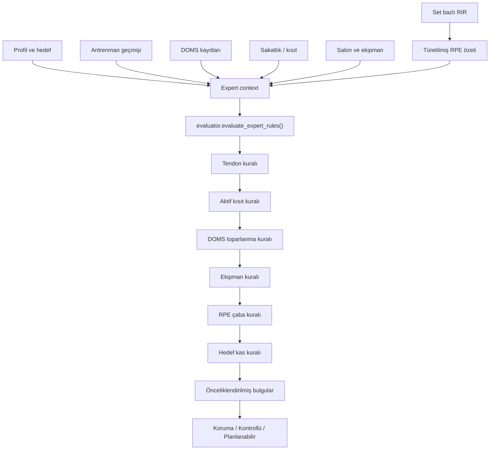

### Uzman sistemi paketleri

| Dosya | Görevi |
|---|---|
| `__init__.py` | Paketin dışarıya açılan fonksiyonlarını belirler |
| `core.py` | Kas normalizasyonu, ekipman, program ve egzersiz seçimi |
| `evaluator.py` | Kuralları sırayla çalıştırır ve sonuçları sıralar |
| `fuzzy_logic.py` | Değerleri 0–1 arasında kademeli üyeliklere dönüştürür |
| `recommendation.py` | Programı haftalık takvime çevirir ve RIR’den RPE üretir |
| `rule_utils.py` | Ortak sayı, etiket, tarih ve bulgu yardımcıları |
| `rules/rule_active_injury.py` | Aktif sakatlık veya kısıt koruması |
| `rules/rule_tendon_injury.py` | Tendon kısıtlarının zaman aşamalarını yönetir |
| `rules/rule_doms_recovery.py` | Kas ağrısı ve toparlanma uyarıları |
| `rules/rule_equipment.py` | Ekipman bilgisinin yeterliliği |
| `rules/rule_rpe_effort.py` | Set çabası ve türetilmiş RPE yorumu |
| `rules/rule_targets.py` | Hedef kasların split odağına katkısı |

### Kural önceliği

Kural değerlendirme sırası güvenlikten performansa doğru ilerler:

```text
Tendon / aktif kısıt
        ↓
DOMS / toparlanma
        ↓
Ekipman uygunluğu
        ↓
RPE / RIR çabası
        ↓
Hedef kas önceliği
```

Örneğin kullanıcı göğüs kasını öncelikli seçmiş olsa bile aktif omuz sakatlığı varsa hedef kas kuralı sakatlık korumasının önüne geçmez.

### Standart bulgu yapısı

Her kural benzer bir JSON nesnesi döndürür. Böylece frontend bütün kuralları aynı kart yapısıyla gösterebilir.

```json
{
  "id": "high-doms-recovery",
  "priority": 84,
  "category": "Toparlanma",
  "title": "Yüksek kas ağrısı bildirimi",
  "message": "Hamstring için DOMS seviyesi yüksek.",
  "action": "Doğrudan setleri azalt veya seansı ertele.",
  "tone": "warn"
}
```

Evaluator bulguları `priority` değerine göre azalan biçimde sıralar. Kural çalışırken hata oluşsa bile diğer kurallar çalışmaya devam eder. Hatalı kural sistemin tamamını kapatmak yerine sistem bulgusu üretir.

---

## Dinamik Program Üretimi

Program üretimi kullanıcının yalnızca haftalık gün sayısına bakmaz. Aşağıdaki verileri birlikte kullanır:

- Ana hedef.
- Öncelikli kaslar.
- Fitness seviyesi.
- Haftalık müsait gün.
- Seans süresi.
- Son antrenman geçmişi.
- Salon ekipmanı.
- Tercih edilen hareketler.
- Kaçınılan hareketler.
- DOMS kayıtları.
- Aktif sakatlık veya tendon kısıtları.
- Hareket ailesi ve yorgunluk maliyeti.

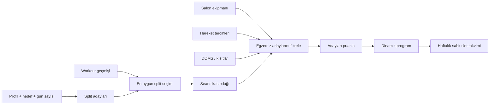

### Haftalık gün sayısına göre başlangıç split yaklaşımı

| Gün sayısı | Başlangıç yaklaşımı | Açıklama |
|---:|---|---|
| 1 | Full Body | Temel bileşik hareketler |
| 2 | Upper / Lower | Üst ve alt vücut ayrımı |
| 3 | Full Body A/B/C | Her seansta farklı vurgu |
| 4 | Upper / Lower ×2 | Frekansı artırılmış düzen |
| 5 | PPL + Upper/Lower | Karma ve esnek split |
| 6 | PPL ×2 | Push, Pull ve Legs A/B |
| 7 | Antrenman + toparlanma | Her gün için kontrollü planlama |

Bu tablo başlangıç split adayını gösterir. Nihai egzersiz seçimi ekipman, tercihler, geçmiş kullanım, DOMS ve aktif kısıtlarla tekrar filtrelenir.

### Sabit gün slotları

Program sürükle-bırak ile düzenlenirken gün adı ile içerik birbirinden ayrılır.

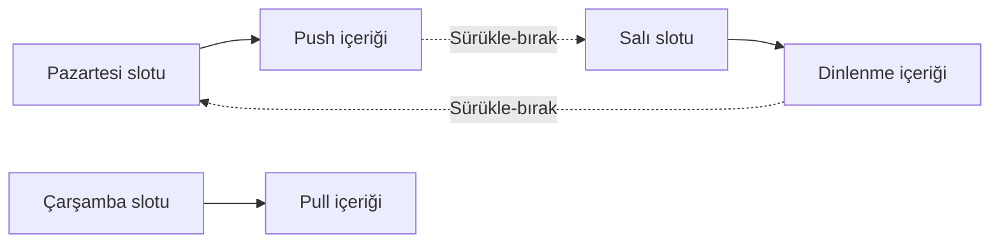

Slot kimliği sabit kalır. İçerik değişebilir. Böylece gün adları ve seans türleri yanlışlıkla birlikte taşınmaz.

---

## RIR ve RPE Mantığı

Kullanıcı workout sırasında set bazında **RIR** girer. RIR, sette teknik bozulma olmadan yaklaşık kaç tekrar daha yapılabileceğini ifade eder.

Sistemin arayüzde RPE üretmek için kullandığı basit dönüşüm şöyledir:

```text
RPE = 10 - RIR
```

| RIR | Türetilmiş RPE | Genel yorum |
|---:|---:|---|
| 5 | 5 | Yüksek tekrar rezervi |
| 4 | 6 | Kontrollü çaba |
| 3 | 7 | Üretken çaba |
| 2 | 8 | Yüksek çaba |
| 1 | 9 | Sınıra yakın çaba |
| 0 | 10 | Teknik olarak tükenişe çok yakın |

Bu eşleme bir kullanıcı arayüzü ve antrenman planlama özetidir. Veritabanında kullanıcıdan gelen asıl veri RIR olarak korunur. Geçmiş workout kayıtları RPE üretmek için geriye dönük değiştirilmez.

RIR verisi olmayan eski kayıtlarda sistem:

- RIR veya RPE özeti yok bilgisini gösterebilir.
- Workout hacmini ve set sayısını yine hesaplayabilir.
- Eski kaydı otomatik olarak değiştirmez.

---

## Egzersiz Kataloğu ve Alias Yapısı

Egzersiz kataloğu `backend/exercise_catalog.py` içinde tutulur. Kanonik egzersiz kimliği geçmiş kayıtlar için kalıcıdır.

```python
_exercise(
    "cable-bayesian-curl",
    "Cable Bayesian Curl",
    "Arms",
    "isolation",
    False,
    family="biceps_curl",
    variation="cable_bayesian",
    primary_muscles=["biceps"],
    secondary_muscles=["forearms"],
    movement_pattern="elbow_flexion",
    equipment=["cable_station"],
    load_mode="external_load",
    fatigue_cost="low",
)
```

### Egzersiz alanları

| Alan | Açıklama |
|---|---|
| `id` | Değişmemesi gereken kanonik kimlik |
| `name` | Kullanıcıya görünen hareket adı |
| `muscle_group` | Genel hareket grubu |
| `category` | `compound` veya `isolation` |
| `is_bodyweight` | Vücut ağırlığı hareketi mi? |
| `family` | Alternatif üretiminde kullanılan hareket ailesi |
| `variation` | Varyasyon bilgisi |
| `primary_muscles` | Doğrudan hedef kaslar |
| `secondary_muscles` | İkincil kaslar |
| `movement_pattern` | Hareket paterni |
| `equipment` | Gerekli ekipman kimlikleri |
| `load_mode` | Dış yük veya vücut ağırlığı |
| `fatigue_cost` | Düşük, orta veya yüksek yorgunluk maliyeti |

### Alias mantığı

Eski veya farklı yazılmış hareket adları `backend/exercise_aliases.py` içinde kanonik id’ye bağlanır.

```python
EXERCISE_ALIASES = {
    "dumbbell calf raise": "calf-raises",
    "calf raise dumbbell": "calf-raises",
}
```

Aynı hareketin görünen adı değiştirilebilir, ancak geçmiş kayıtlarla bağlantıyı korumak için `id` değiştirilmemelidir.

> **Temel güvenlik kuralı:** Geçmiş workout kayıtlarında bulunabilecek bir hareket katalogdan tamamen silinmemelidir. Gerekirse yalnızca uzman önerilerinden çıkarılır.

Uzman önerilerinden çıkarma işlemi, ilgili id’yi uzman kataloğu dışlama kümesine ekleyerek yapılır. Bu işlem geçmiş veriyi silmez.

---

## API Grupları

### Kimlik ve sağlık

| Method | Endpoint | Amaç |
|---|---|---|
| `POST` | `/api/auth/register` | Yeni kullanıcı oluşturur |
| `POST` | `/api/auth/login` | JWT token üretir |
| `GET` | `/api/auth/me` | Mevcut kullanıcıyı döndürür |
| `GET` | `/api/health` | Uygulama ve DB sağlık kontrolü |

### Profil ve dashboard

| Method | Endpoint | Amaç |
|---|---|---|
| `GET` | `/api/profile` | Profil verisini okur |
| `PUT` | `/api/profile` | Profil bilgilerini günceller |
| `GET` | `/api/dashboard` | Dashboard özeti üretir |
| `GET` | `/api/workouts/stats` | Antrenman istatistiklerini döndürür |

### Workout ve geçmiş

| Method | Endpoint | Amaç |
|---|---|---|
| `GET` | `/api/workouts` | Kullanıcının workout listesini getirir |
| `POST` | `/api/workouts` | Yeni workout kaydeder |
| `GET` | `/api/workouts/{id}` | Tek workout getirir |
| `PUT` | `/api/workouts/{id}` | Workout günceller |
| `DELETE` | `/api/workouts/{id}` | Workout siler |
| `GET` | `/api/history` | Geçmiş ekranı için kayıt döndürür |

### Egzersiz ve ilerleme

| Method | Endpoint | Amaç |
|---|---|---|
| `GET` | `/api/exercises` | Katalogu ve filtreleri döndürür |
| `GET` | `/api/progress` | İlerleme özetini döndürür |
| `GET` | `/api/progress/chart` | Grafik verisi üretir |
| `GET` | `/api/dashboard/muscle-distribution` | Kas dağılımını döndürür |

### Uzman sistemi

| Method | Endpoint | Amaç |
|---|---|---|
| `GET` | `/api/expert-data` | Merkezî uzman profilini ve katalogları döndürür |
| `GET` | `/api/expert-data/analysis` | Kural tabanlı analiz üretir |
| `POST` | `/api/expert-data/recommendation/generate` | Dinamik program taslağı oluşturur |
| `PUT` | `/api/expert-data/recommendation/reorder` | Haftalık içerikleri kaydeder |
| `POST` | `/api/expert-data/rpe-checkins` | RPE kontrol kaydı ekler |
| `PUT` | `/api/expert-data/goals` | Hedef ve öncelikli kasları kaydeder |
| `PUT` | `/api/expert-data/doms` | Güncel DOMS kaydı ekler veya günceller |
| `DELETE` | `/api/expert-data/doms/{date}/{muscle}` | DOMS kaydı siler |
| `POST` | `/api/expert-data/gyms` | Salon oluşturur |
| `PUT` | `/api/expert-data/equipment-preferences` | Ekipman tercihlerini kaydeder |
| `PUT` | `/api/expert-data/movement-preferences` | Hareket tercihlerini kaydeder |
| `GET` | `/api/expert-data/exercise-alternatives/{id}` | Alternatif hareketleri getirir |
| `PUT` | `/api/expert-data/recommendation/exercise-replace` | Önerideki hareketi değiştirir |
| `POST` | `/api/expert-data/injuries` | Sakatlık/kısıt ekler |
| `PUT` | `/api/expert-data/injuries/{id}` | Sakatlık/kısıt günceller |
| `DELETE` | `/api/expert-data/injuries/{id}` | Sakatlık/kısıt siler |

### Admin

Admin endpoint’leri JWT doğrulamasına ek olarak admin rol kontrolünden geçmelidir. Admin arayüzündeki ürün odaklı metrikler; kullanıcı büyümesi, retention, workout ekosistemi, egzersiz kullanımı, uzman öneri kabul oranı ve veri sağlığı gibi başlıkları kapsar.

---

## Hızlı Başlangıç

### Gereksinimler

- Python 3.10 veya üzeri
- `pip`
- Git
- SQLite veya PostgreSQL
- Modern bir web tarayıcısı

### Linux / macOS

```bash
git clone <repository-url>
cd Hypertrophy-X-v4.0

python3 -m venv venv
source venv/bin/activate

pip install -r backend/requirements.txt
cp backend/.env.example backend/.env
```

`backend/.env` dosyasında en azından aşağıdaki değerleri düzenle:

```env
DATABASE_BACKEND=sqlite
DATABASE_URL=
JWT_SECRET=replace-with-a-long-random-secret
ADMIN_USERNAME=admin
ADMIN_PASSWORD=replace-with-a-strong-password
CORS_ORIGINS=http://127.0.0.1:8000
```

Uygulamayı başlat:

```bash
cd backend
../venv/bin/python -m uvicorn main:app --host 0.0.0.0 --port 8000
```

Tarayıcıdan aç:

```text
http://127.0.0.1:8000
```

### Windows PowerShell

```powershell
cd Hypertrophy-X-v4.0
python -m venv venv
.\venv\Scripts\Activate.ps1
pip install -r backend\requirements.txt
Copy-Item backend\.env.example backend\.env
cd backend
python -m uvicorn main:app --host 0.0.0.0 --port 8000
```

### İlk çalıştırmada ne olur?

1. Backend veritabanı bağlantısını oluşturur.
2. Gerekli tabloları `CREATE TABLE IF NOT EXISTS` ile hazırlar.
3. Eski SQLite şeması varsa eksik sütunları kontrol eder.
4. Admin hesabını ortam değişkenlerindeki değerlerle oluşturur veya günceller.
5. Uygulama `8000` portunda istek bekler.

> `.env`, `hypertrophy.db`, sanal ortam ve yedek klasörleri sürüm kontrolüne eklenmemelidir.

---

## Test ve Doğrulama

### Python sözdizimi kontrolü

```bash
cd Hypertrophy-X-v4.0

python3 -m py_compile \
  backend/main.py \
  backend/exercise_catalog.py \
  backend/exercise_aliases.py \
  backend/expert_system/__init__.py \
  backend/expert_system/core.py \
  backend/expert_system/evaluator.py \
  backend/expert_system/fuzzy_logic.py \
  backend/expert_system/recommendation.py
```

### Git boşluk kontrolü

```bash
git diff --check
```

### API sağlık kontrolü

```bash
curl http://127.0.0.1:8000/api/health
```

Örnek yanıt:

```json
{
  "status": "ok",
  "database": "ok"
}
```

### Uzman sistemi import kontrolü

```bash
cd backend
python3 -c "from expert_system import evaluate_expert_rules, generate_dynamic_program; print('expert_system: OK')"
```

### Manuel smoke test

| Test | Beklenen sonuç |
|---|---|
| Yeni kullanıcı kaydı | Hesap oluşturulur |
| Hatalı giriş | JWT verilmez |
| Workout kaydı | `workouts` tablosuna kayıt eklenir |
| RIR girişi | Set JSON’unda RIR saklanır |
| Uzman analiz ekranı | JSON bulguları yüklenir |
| Yüksek DOMS | Kontrollü veya toparlanma uyarısı görünür |
| Aktif sakatlık | Koruma öncelikli durum görünür |
| Hareket alternatifi | Aynı kas ve hareket ailesine uygun liste gelir |
| Program sürükleme | Sabit gün slotlarının içeriği kaydedilir |
| Admin olmayan kullanıcı | Admin endpoint’ine erişemez |

---

## Deployment

### Railway veya Render

1. Projeyi GitHub’a gönder.
2. Railway veya Render’da repository’yi bağla.
3. `railway.toml`, `render.yaml` veya `Procfile` yapılandırmasını kullan.
4. Ortam değişkenlerini platform panelinden tanımla.
5. Sağlık kontrolü için `/api/health` endpoint’ini kullan.

Gerekli üretim değişkenleri:

```env
DATABASE_BACKEND=postgresql
DATABASE_URL=postgresql://...
JWT_SECRET=long-random-production-secret
ADMIN_USERNAME=admin
ADMIN_PASSWORD=strong-production-password
CORS_ORIGINS=https://your-domain.example
```

### VPS + Nginx

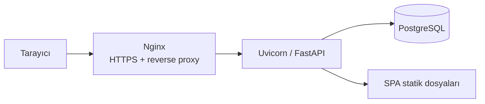

Örnek systemd servisi:

```ini
[Unit]
Description=Hypertrophy-X
After=network.target

[Service]
User=www-data
WorkingDirectory=/var/www/hypertrophy-x/backend
Environment="PATH=/var/www/hypertrophy-x/venv/bin"
ExecStart=/var/www/hypertrophy-x/venv/bin/uvicorn main:app --host 127.0.0.1 --port 8000
Restart=always

[Install]
WantedBy=multi-user.target
```

Örnek Nginx reverse proxy:

```nginx
server {
    listen 80;
    server_name example.com;

    location / {
        proxy_pass http://127.0.0.1:8000;
        proxy_set_header Host $host;
        proxy_set_header X-Real-IP $remote_addr;
        proxy_set_header X-Forwarded-For $proxy_add_x_forwarded_for;
        proxy_set_header X-Forwarded-Proto $scheme;
    }
}
```

Üretimde HTTP yerine HTTPS kullanılmalı ve TLS sertifikası Let’s Encrypt gibi bir servisle etkinleştirilmelidir.

---

## Güvenlik Kontrol Listesi

| Kontrol | Geliştirme | Üretim beklentisi |
|---|---|---|
| JWT secret | `.env` içinden okunur | Uzun, rastgele ve benzersiz olmalı |
| Admin parolası | `.env` içinden okunur | Güçlü ve periyodik değiştirilmeli |
| Parola saklama | Hash | bcrypt/Argon2 tercih edilmeli |
| CORS | Yerel origin | Yalnızca gerçek frontend domaini |
| HTTPS | Yerelde opsiyonel | Zorunlu |
| DB dosyası | Yerelde kullanılabilir | Git ve public depodan hariç tutulmalı |
| SQL | Parametreli sorgu | Parametreli sorgu ve yetki sınırı |
| Admin API | Rol kontrolü | Rol + izin bazlı erişim |
| Loglar | Uvicorn/application log | Yapılandırılmış merkezi log |
| Yedekleme | Manuel olabilir | Zamanlanmış ve test edilmiş olmalı |
| Sağlık kontrolü | `/api/health` | Monitoring sistemiyle izlenmeli |

---

## Geliştirme İlkeleri

### 1. Kanonik kimlikleri koru

Bir egzersizin geçmiş workout kayıtlarında bulunma ihtimali varsa id değerini değiştirme. Görünen adı değiştirmek gerekiyorsa alias veya yalnızca etiket değişikliği kullan.

### 2. Veri değişikliğinden önce yedek al

```bash
STAMP=$(date +%Y%m%d_%H%M%S)
mkdir -p ".local-backups/manual-${STAMP}"
cp -p backend/main.py ".local-backups/manual-${STAMP}/"
cp -p backend/exercise_catalog.py ".local-backups/manual-${STAMP}/"
cp -p backend/exercise_aliases.py ".local-backups/manual-${STAMP}/"
```

### 3. Uzman kuralını ayrı dosyada tut

Yeni bir uzman kuralı için mevcut kural dosyalarının içine rastgele kod eklemek yerine `backend/expert_system/rules/` altında yeni modül oluştur. Kuralı `evaluator.py` içindeki `RULES` listesine ekle.

### 4. Frontend kararların sahibi olmasın

Frontend yalnızca kullanıcı deneyimini yönetmelidir. Yetki, veri sahipliği, aralık kontrolü ve güvenlik backend’de uygulanmalıdır.

### 5. Geriye dönük uyumluluğu koru

Eski endpoint’leri, eski workout kayıtlarını ve eski egzersiz isimlerini gereksiz yere silme. Yeni API veya katalog davranışı eklerken mevcut veriyi koruyacak normalizasyon ve alias yaklaşımı kullan.

### 6. Hata durumlarını tasarla

Her API isteği için en az şu durumlar düşünülmelidir:

```text
loading → success
loading → empty
loading → validation error
loading → unauthorized
loading → server error
```

### 7. Küçük ve test edilebilir değişiklik yap

Aynı anda katalog, veritabanı, uzman kuralı ve frontend render yapısını değiştirmek yerine değişiklikleri ayrı adımlara böl. Her adım sonrasında `py_compile`, `git diff --check` ve temel API testlerini çalıştır.

---

## Bilinen Sınırlar

- SQLite tek dosyalı yapı olarak geliştirme ve sunum için uygundur; yoğun eşzamanlı üretim kullanımı için PostgreSQL tercih edilmelidir.
- Bazı esnek uzman sistemi verileri JSON sütunlarında tutulur. Çok büyük veri hacminde sık sorgulanan alanlar normalize tablolara ayrılabilir.
- RIR’den RPE üretimi pratik bir planlama eşlemesidir; klinik veya kesin fizyolojik ölçüm değildir.
- Uzman sistemi tıbbi tanı koymaz ve tedavi önermez.
- Admin panelindeki yüksek etkili veri silme veya güvenlik değişiklikleri ayrıca yetki ve audit kontrolü gerektirir.
- Mevcut SPA tek dosyada büyüdükçe frontend modüllerinin ayrı JavaScript ve CSS dosyalarına ayrılması bakım maliyetini düşürebilir.
- Production’da otomatik yedekleme, merkezi loglama, monitoring ve rate limit ayrıca yapılandırılmalıdır.

---

## Lisans

Bu proje özel kullanım ve eğitim amaçlı geliştirilmiştir. Kaynak kodun, veri modelinin ve marka varlıklarının ticari veya kamusal kullanımından önce proje sahibinden izin alınmalıdır.

---

## Referanslar

[1]: https://fastapi.tiangolo.com/ "FastAPI resmi dokümantasyonu"
[2]: https://developer.mozilla.org/en-US/docs/Web/JavaScript "MDN JavaScript dokümantasyonu"
[3]: https://www.postgresql.org/docs/ "PostgreSQL resmi dokümantasyonu"
[4]: https://www.chartjs.org/docs/latest/ "Chart.js resmi dokümantasyonu"
[5]: https://mermaid.js.org/intro/ "Mermaid resmi dokümantasyonu"
[6]: ./docs/Hypertrophy-X%20%E2%80%94%20Modern%20Platform%20Mimarisi%20Rehberi.md "Hypertrophy-X modern platform mimarisi rehberi"
[7]: ./docs/Hypertrophy-X_Egzersiz_Katalog_Yonetim_Kilavuzu.md "Hypertrophy-X egzersiz kataloğu yönetim kılavuzu"
[8]: ./docs/MIGRATION_REHBERI.md "Hypertrophy-X veritabanı migration rehberi"
[9]: ./backend/main.py "Hypertrophy-X FastAPI backend ve veritabanı şeması"
[10]: ./backend/expert_system/core.py "Uzman sistemi çekirdeği ve dinamik program motoru"
[11]: ./backend/expert_system/evaluator.py "Uzman sistemi kural değerlendiricisi"
[12]: ./backend/expert_system/recommendation.py "RIR-RPE özeti ve öneri takvimi"
[13]: ./backend/expert_system/rules/rule_active_injury.py "Aktif kısıt kuralı"
[14]: ./backend/expert_system/rules/rule_doms_recovery.py "DOMS toparlanma kuralı"
[15]: ./backend/expert_system/rules/rule_rpe_effort.py "RPE çaba kuralı"

---

<div align="center">

**Hypertrophy-X — Kişisel veriden açıklanabilir antrenman karar desteğine**

</div>
